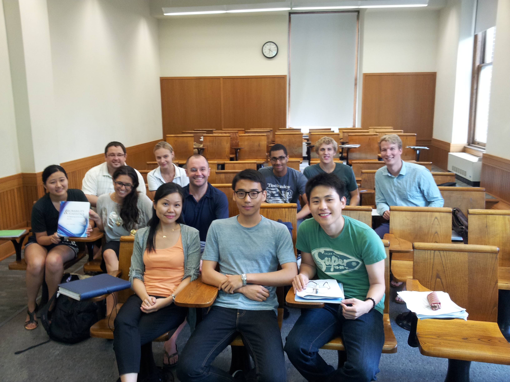

S1211Q Introduction to Statistics with Calculus

- Syllabus \[[html](./syllabus.html)\] \[[pdf](./syllabus.pdf)\]
- [R resources](../r_resources.html)
- [Intro and Teaser](./intro.html)
- [Lecture 1](./lecture1.pdf), [R Demo Code](./R_demo_1.R), July 2

  Population and Sample, Probability and Statistical Inference, Stem-and-Leaf
  Displays, Dotplot, Histogram

  Textbook sections covered: 1.1, 1.2

  Homework 1: Exercise 1.3, 1.12, 1.24, 1.36, 1.38, 1.44. [R Code](./hw1.R). Due at the end of Friday lecture. 

- [Little Quiz](./quiz2.html), [Lecture 2](./lecture2.pdf), [R Demo
  Code](./R_demo_2.R), July 3

  Histogram, Measure of Location, Mean and Median,  Measure of Variability, Box Plot, Standard Deviation

  Textbook sections covered: 1.2, 1.3, 1.4

- [Little Quiz](./quiz3.html), [Lecture 3](./lecture3.pdf), [R Demo
  Code](./R_demo_3.R), July 5

  Experiments and Events, Event Operations, Axioms of Probability, Basic Properties

  Textbook sections covered: 1.4, 2.1, 2.2

- [Little Quiz](./quiz4.html), [Lecture 4](./lecture4.pdf), July 6, Homework 1 Due

  Probability Properties continued, Counting Techniques

  Textbook sections covered: 2.2, 2.3

   Homework 2: Exercises 
  - 1.54 (Boxplot)
  - 2.3, 2.8 (Events)
  - 2.11, 2.26 (Probability)
  - 2.29, 2.35, 2.38 (Counting)
  - 2.56, 2.59 (Conditional Probability)
  - 2.74, 2.78, 2.80 (Independence) 

  Due at the end of Wed July 11^th lecture.

- [Lecture 5](./lecture5.pdf), July 9

  Conditional Probability and Independence

  Textbook sections covered: 2.4, 2.5

- [Lecture 6](./lecture6.pdf), July 10

  Independence, Random Variables, Discrete Distributions
  
  Textbook sections covered: 2.5, 3.1, 3.2

  Midterm 1 covers materials up to this lecture.
  
  Midterm 1 practice questions: 1.57, 1.78, 2.42, 2.93, 2.100, 2.101, 3.11 

- [Lecture 7](./lecture7.pdf), July 11, Homework 2 Due.

  CDF, Expectation, Variance, Binomial Distribution
  
  Textbook sections covered: 3.3, 3.4 

  Homework 3: 
  - 3.10, 3.19, 3.24 (Discrete RV and Distributions) 
  - 3.30, 3.33, 3.37 (Expectation and Variance) 
  - 3.47, 3.49, 3.50, 3.81 (Binomial and Poisson Distribution)
  
  Due at the end of Wed July 18^th lecture
  
- [Lecture 8](./lecture8.pdf), July 12

  Binomial Distribution Cont'd, 1^st midterm
  
  Textbook sections covered: 3.4

- [Little Quiz](./quiz9.html), [Lecture 9](./lecture9.pdf), [R Demo](./R_demo_9.R), July 16

  Poisson Distribution, Continuous Probability Distributions, Uniform Distribution

  Textbook sections covered: 3.6, 4.1, 4.2

- [Little Quiz](./quiz10.html), [Lecture 10](./lecture10.pdf), July 17

  Normal Distribution, Exponential Distribution
  
  Textbook sections covered: 4.3, 4.4

- [Little Quiz](./quiz11.html), [Lecture 11](./lecture11.pdf), July 18

  Jointly Distributed Random Variables
  
  Textbook sections covered: 5.1, 5.2

  Homework 4: 
  - 4.2, 4.4 (Continuous Distributions) 
  - 4.12, 4.15, 4.19 (CDF and Expected Values) 
  - 4.28 e, f, g; 4.29 a, c, d; 4.36, 4.45 (Normal Distribution)
  - 4.60 (Exponential Distribution)
  - 5.7, 5.22 (Joint Distribution)

  Due at the end of Tue July 24^th lecture       

- [Lecture 12](./lecture12.pdf), July 19

  Statistics and Their Sampling Distributions
  
  Textbook sections covered: 5.3, 5.4

- [Little Quiz](./quiz13.html), [Lecture 13](./lecture13.pdf), [R Demo](./R_demo_13.R), July 23

  Central Limit Theorem, Point Estimation
  
  Textbook sections covered: 5.4, 6.1, 6.2

- [Little Quiz](./quiz14.html), [Lecture 14](./lecture14.pdf), July 24

  Point Estimation Cont'd, Intro to Confidence Interval
  
  Textbook sections covered: 6.2, 7.1

  Homework 5: 
  - 5.46, 5.50, 5.53 (Distribution of Sample Mean)
  - 5.60 (Distribution of Linear Combinations)  
  - 6.3, 6.5, 6.28 (Point Estimation)
  - 7.3, 7.6 (Confidence Interval)

  Due at the end of Tue July 31^st lecture

  2^nd Midterm Coverage in Sections
  - 3.3, 3.4, 3.6(no Poisson Process)
  - 4.1, 4.2, 4.3(no Approximating the Binomial Distribution), 4.4(The Exponential Part), 
  - 5.1, 5.2(understand the concepts, no calculation required), 5.4, 5.5
  - 6.1
  

   2^nd Midterm Practice Problems: 3.80, 3.97, 4.28, 4.29, 4.105, 4.106, 5.59, 6.4 
  
- [Little Quiz](./quiz15.html), [Lecture 15](./lecture15.pdf), July 25

  Large-sample CI for a Population Mean, CI for a Population Proportion, The t Distributions
  
  Textbook sections covered: 7.2, 7.3

- [Lecture 16](./lecture16.pdf), July 26

  Intervals Based on t Distribution, 2^nd midterm
  
  Textbook sections covered: 7.3

- [Lecture 17](./lecture17.pdf), July 30

  Intro to Hypothesis Testing, Testing Procedures and Errors
  
  Textbook sections covered: 8.1

- [Lecture 18](./lecture18.pdf), July 31, Homework 5 Due

  Testing Hypothesis about a Single Mean and Proportion
  
  Textbook sections covered: 8.2, 8.3

- [Lecture 19](./lecture19.pdf), August 1

  P-values, Intro to Two Samples Inference
  
  Textbook sections covered: 8.4, 9.1

  Homework 6: 
  - 7.13, 7.18 (Intervals based on Normal Distribution)
  - 7.32, 7.34a  (t Intervals)  
  - 8.5 (Test Procedure)
  - 8.16, 8.25, 8.26, 8.29a (Test Concerning a Population Mean)
  - 8.37 (Test Concerning a Population Proportion)
  - 8.51a,b,c, 8.55, 8.58 (P-Values)

  Due at the end of Wed Aug 8^th lecture

- [Little Quiz](./quiz20.html), [Lecture 20](./lecture20.pdf), August 2

  Two-Sample t test and CI, Scatter Plot
  
  Textbook sections covered: 9.2, 9.3, 12.1

- [Lecture 21](./lecture21.pdf), August 6

  Simple Linear Regression, Estimation of Model Parameters
  
  Textbook sections covered: 12.1, 12.2

   Final Exam Practice Problems: 2.38a b c, 2.100b, 3.50, 3.81, 4.45, 4.106, 5.60, 6.11, 7.20, 8.58(Also give a 95% Confidence Interval for the population mean), 12.12abcd  

  I will go over these problems on Tuesday and Wednesday's lectures.

- [Lecture 22](./lecture22.pdf), [R Code](./R_demo_22.R), August 7

  Inference about the Slope
  
  Textbook sections covered: 12.3

- Lecture 23, August 8

  Review and [Photo](./S1211_2012.jpg)

- Lecture 24, August 9

  Final Exam
  
  

